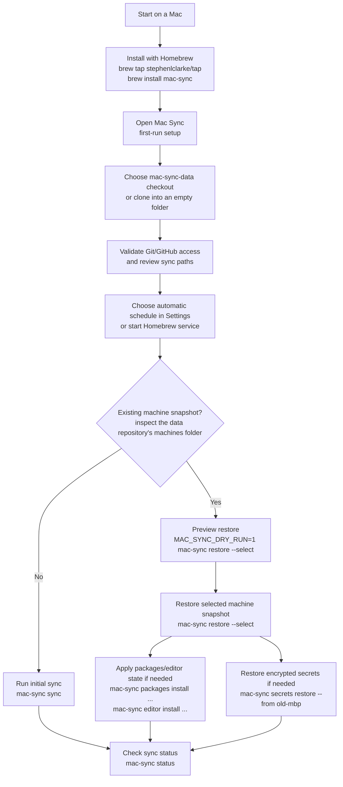
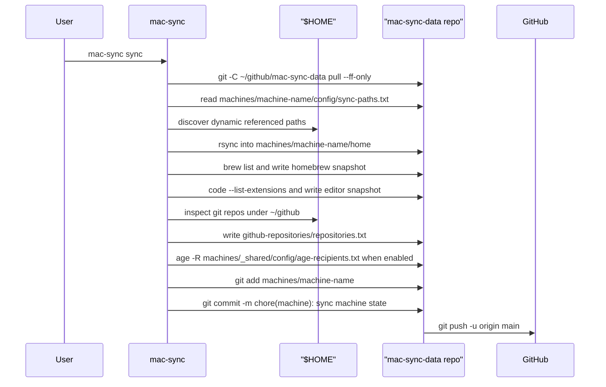
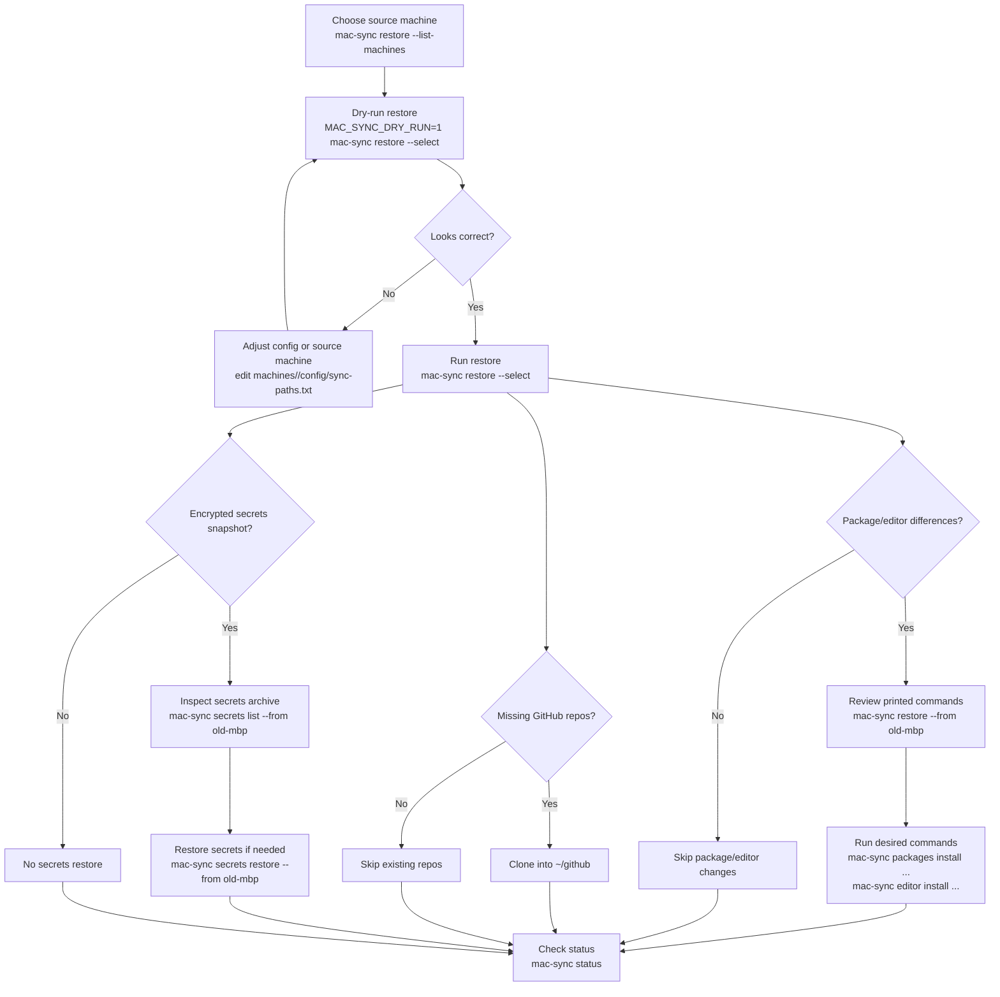
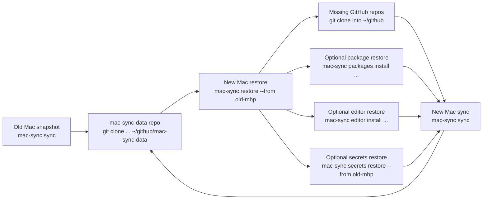

# mac-sync Workflow

This workflow describes how to download, configure, install, sync, restore, and update `mac-sync` on a Mac.

mac-sync is implemented as a SwiftPM package with a CLI and a native SwiftUI
macOS app. Homebrew owns the installed executables and app bundle. Automatic
sync can be controlled either by the app's per-user launchd agent or by the
optional Homebrew service. The app does not create a second sync
implementation: it runs the packaged mac-sync CLI and reads the same local
status and machine snapshot records.

`mac-sync` uses one private data repository:

- `~/github/mac-sync-data`: per-machine snapshots and configuration under
  `machines/<machine-name>/`, including dotfiles, Homebrew state, VS Code
  extension state, encrypted secrets, GitHub clone inventory, and the selected
  sync paths. The installed app and default CLI flow do not use the legacy
  `dot-files` repository; explicit legacy CLI overrides remain available only
  for migration and compatibility work.

## End-to-End Flow

<!-- markdownlint-disable MD013 -->



<!-- markdownlint-enable MD013 -->

## Download

Install Homebrew first if this Mac does not already have it. Then install the
released Swift binary and runtime dependencies from Homebrew:

```sh
brew tap stephenlclarke/tap
brew install mac-sync
open "$(brew --prefix mac-sync)/MacSync.app"
```

The formula installs the required non-system runtime commands: `age`, GNU tar
(`gtar`), Git, and rsync. Finder-launched Mac Sync adds Homebrew's standard paths
before invoking its bundled CLI, and both scheduling options declare the same
PATH. Its setup, sync, restore, and encrypted-secret flows therefore find the
installed tools in either mode. Keychain access and the other POSIX utilities
are provided by the supported macOS versions.

VS Code is optional. Install it with `brew install --cask visual-studio-code`
when you want Mac Sync to capture or apply VS Code extension snapshots.

Open Mac Sync after Homebrew installation. Its first-run assistant detects an
existing data checkout, lets you choose an alternate local folder, and clones
only when you select **Clone mac-sync-data Repository**. A new empty data
repository is valid; the first sync creates and pushes its initial snapshot.
During a clone, the assistant shows the active destination, an indeterminate
progress bar, and an elapsed timer.

If the selected location contains a non-Git legacy folder, choose **Back Up
Legacy Folder and Clone…**. After confirmation, Mac Sync moves the existing
folder to the next available `.before-mac-sync` backup path and clones into the
original location. If cloning fails, it restores the original folder when
possible and otherwise reports the exact backup location. Nothing in the legacy
folder is deleted.

The data repository defaults to:

```text
~/github/mac-sync-data
```

The app writes that location, but no credentials, to
`~/Library/Application Support/mac-sync/config.env`; the GUI, CLI, app-managed
schedule, and Homebrew service share it. Existing SSH and Keychain-backed Git
credentials are used for remote access. For scripted setup, environment
variables still take precedence:

```sh
MAC_SYNC_MACHINES_REPO=/path/to/mac-sync-data \
mac-sync status
```

## Configure

Review the tracked configuration before the first sync. The regular path list
lives with the current machine in `mac-sync-data`:

```sh
mac-sync manifest configured
```

- `machines/<machine>/config/sync-paths.txt`: regular dotfiles and directories
  to copy
- `machines/<machine>/config/excludes.txt`: `rsync` exclude patterns used
  during dotfile sync
- `machines/<machine>/config/secret-paths.txt`: sensitive paths encrypted into
  the secrets archive
- `machines/_shared/config/age-recipients.txt`: public `age` recipients trusted
  to decrypt every machine's secrets

The default machine name is derived from the macOS host name. Set
`MAC_SYNC_MACHINE` when running manual commands if you want a stable or
friendlier directory name:

```sh
MAC_SYNC_MACHINE=work-mbp mac-sync status
```

Machine names may contain letters, digits, `.`, `_`, and `-`, but cannot be
`.` or `..` or start with `-`. Configured and persisted sync paths are checked
for path traversal before they are read or written.

The machine snapshot will be written under:

```text
~/github/mac-sync-data/machines/<machine-name>/
```

## Install

Homebrew owns installation. Use the app's **Settings → Automatic sync** for a
per-user schedule, or use the Homebrew service as an hourly terminal-managed
alternative. Do not run both schedules at once:

```sh
brew tap stephenlclarke/tap
brew install mac-sync
```

Use Homebrew for updates, restarts, and removal:

```sh
brew upgrade mac-sync
brew services restart mac-sync
brew services stop mac-sync
brew uninstall mac-sync
```

The app appears in the menu bar as Mac Sync. On first launch, it guides you
through choosing or cloning the single data repository and can test GitHub
access without prompting for or storing credentials. Use it to inspect the
local snapshot, browse peer-machine files, revise the configured file and
folder selection, start or stop sync, and preview a restore before applying it.
Sync Selection is initialised from the current machine's `config/sync-paths.txt`;
saving the selection updates that same tracked file.

When restoring from another Mac, choose **Copy specific paths only** in the
app to copy just the selected snapshot roots. This deliberately skips the
package, editor, repository, and secrets restore hints, which remain part of a
normal full restore.

For local development, build and launch the native app from the checkout:

```sh
cd ~/github/mac-sync
./script/build_and_run.sh
dist/mac-sync/MacSync.app/Contents/Resources/mac-sync --help
```

## Initial Sync

Run a manual sync once after installation:

```sh
mac-sync sync
```

During sync, `mac-sync`:

1. Pulls the `mac-sync-data` repository when the current machine archive is
   clean, preserving unrelated local edits in that checkout.
2. Copies configured paths from `$HOME` into the machine snapshot.
3. Discovers safe referenced dotfiles and persists dynamic paths.
4. Captures Homebrew taps, formulae, casks, and a generated `Brewfile`.
5. Captures VS Code extensions when the `code` CLI is available.
6. Captures GitHub repos below `~/github` that have GitHub remotes.
7. Updates an encrypted secrets snapshot when recipients and tools exist.
8. Commits and pushes `machines/<machine-name>` in the data repository.

Homebrew and VS Code inventories are collected before their snapshot files are
written. If either inventory command fails, sync stops and preserves the last
complete snapshot. Existing encrypted secrets are also decrypted and compared
before replacement; a decryption failure preserves the current archive and
stops sync.

<!-- markdownlint-disable MD013 -->



<!-- markdownlint-enable MD013 -->

Check status after the first run:

```sh
mac-sync status
```

The status output shows the `mac-sync` version SHA, data repository, last sync
result, storage totals, warnings, errors, remote repo, and commit. Explicit
legacy CLI mode reports its separate local and machines repositories.

## Automatic Sync

In the Mac Sync app, open **Settings → Automatic sync** and choose **Days and
time** to select any days of the week and the local time to run. The app
installs a per-user `launchd` job and uses the same local repository
configuration as the CLI. It also supports preset intervals from every 30
minutes to daily and custom intervals from 15 minutes to 31 days.

If you choose the app-managed schedule, stop the optional Homebrew hourly
service first so only one job runs:

```sh
brew services stop mac-sync
```

For scripted or terminal-only installations, the existing Homebrew service
remains an hourly alternative:

```sh
brew services start mac-sync
brew services restart mac-sync
brew services info mac-sync
```

Both schedules run `mac-sync run`, the automation entrypoint for `sync`.
Local sync status is written outside git:

```text
~/Library/Application Support/mac-sync/status/<machine-name>.env
```

Each completed real publish or restore also writes a local JSON history record
under `~/Library/Application Support/mac-sync/status/history/<machine-name>/`.
The SwiftUI app presents these records as uploads, downloads, new or updated
files, and skipped items. Preview runs and decrypted secret contents are never
recorded there.

Warnings and errors from completed runs also feed the local **Manual Triage**
queue under `status/issues/`. Scheduled and background syncs continue while
items are open. The Overview shows an open item in the Manual Triage card and
does not repeat the same message under Latest warnings and errors. Acknowledging
an item clears its Dock badge count; resolving it keeps the decision in the
local record. Triage records are never synced.

## Restore

Use restore when setting up a new Mac or copying a snapshot from another Mac.

Install the Homebrew package, then open Mac Sync and let the first-run assistant
choose or clone the data repository. For a terminal-only setup, clone it
manually:

```sh
brew tap stephenlclarke/tap
brew install mac-sync
mkdir -p ~/github
git clone https://github.com/stephenlclarke/mac-sync-data ~/github/mac-sync-data
```

List available machine snapshots:

```sh
mac-sync restore --list-machines
```

If this Mac's hostname has no matching snapshot, `mac-sync restore` offers the
available machines from the `mac-sync-data` repo. If the hostname does match a
snapshot, `mac-sync restore` defaults to that snapshot; use `--select` to choose
another source interactively.

Preview a restore before writing files:

```sh
MAC_SYNC_DRY_RUN=1 mac-sync restore --select
```

Restore the selected snapshot:

```sh
mac-sync restore --select
```

Use `--force` only when the snapshot should win over newer local files:

```sh
mac-sync restore --from old-mbp --force
```

Restore copies regular dotfiles and prints Homebrew and VS Code commands when
the selected machine snapshot differs from the current Mac. It does not run
those package/editor commands for you. It also clones missing GitHub repos from
the selected machine's `github-repositories/repositories.txt` into `~/github`,
skipping targets that already exist.

<!-- markdownlint-disable MD013 -->



<!-- markdownlint-enable MD013 -->

## Encrypted Secrets

Initialize this Mac's Keychain-backed `age` identity:

```sh
mac-sync secrets init
```

That command stores the private identity in Apple Keychain and writes only the
public recipient to `machines/_shared/config/age-recipients.txt` in
`mac-sync-data`. New snapshots are encrypted for every recipient in that shared
registry; after adding a Mac, run `mac-sync sync` once on each source Mac to
re-encrypt its archive for the new recipient.

Update the encrypted snapshot manually:

```sh
mac-sync secrets sync
```

Inspect a source machine's encrypted archive:

```sh
mac-sync secrets list --from old-mbp
```

The Mac app provides the same safe inspection from a machine's detail view:
**View Encrypted Secrets** uses the current Mac's Keychain identity to list
archive file and folder names. It never displays decrypted secret values or
writes files.

Restore encrypted secrets:

```sh
mac-sync secrets restore --from old-mbp
```

Secrets restore refuses to overwrite existing local files unless `--force` is
used:

```sh
mac-sync secrets restore --from old-mbp --force
```

## Moving to Another Mac

For a replacement Mac, the usual order is:

1. Install the Homebrew package.
2. Open Mac Sync and use first-run setup to choose or clone `mac-sync-data`.
3. Choose an app-managed schedule or start the Homebrew service when this Mac
   is ready for scheduled syncs.
4. Run `mac-sync restore --list-machines` and pick the old Mac snapshot.
5. Run `MAC_SYNC_DRY_RUN=1 mac-sync restore --from <old-machine>`.
6. Run `mac-sync restore --from <old-machine>`.
7. Run `mac-sync packages install --from <old-machine>` if you want the old
   Homebrew state.
8. Run `mac-sync editor install --from <old-machine>` if you want the old VS
   Code extension state.
9. Run `mac-sync secrets init` to add this Mac as a trusted recipient.
10. Run `mac-sync secrets restore --from <old-machine>` if needed.
11. Re-run `mac-sync restore --from <old-machine>` if private repo cloning
    needed secrets that were restored in the previous step.
12. Run `mac-sync sync` to create this Mac's own snapshot.
13. Confirm with `mac-sync status`.

<!-- markdownlint-disable MD013 -->



<!-- markdownlint-enable MD013 -->

## Useful Commands

```sh
mac-sync help
mac-sync help restore
mac-sync help secrets
mac-sync list
mac-sync status
mac-sync sync
mac-sync restore --from <machine>
mac-sync packages diff --from <machine>
mac-sync packages install --from <machine>
mac-sync editor diff --from <machine>
mac-sync editor install --from <machine>
mac-sync manifest list
mac-sync secrets list --from <machine>
mac-sync secrets restore --from <machine>
brew services restart mac-sync
brew upgrade mac-sync
```

## Development and Release Validation

Run the same local validation and release packaging used by CI:

```sh
cd ~/github/mac-sync
make ci
make package-release
```

`make ci` runs Swift unit tests and every shell regression against
coverage-instrumented executables, writes `coverage.lcov` and the
Sonar-compatible `coverage.xml`, and enforces at least 85% line coverage across
`MacSyncCore.swift` and `Support.swift`. It also runs CLI smoke checks and
repository lint checks. SonarCloud scans all maintained source for
static-analysis findings and applies coverage only to those two instrumented
core files.

Every successful `main` CI run queues a Current build after CodeQL passes for
the same commit. Current uses the movable `current` tag, a commit-addressed
archive, and the opt-in `mac-sync-current` Homebrew formula. Stable releases use
immutable semantic tags, a fixed archive name, and the default `mac-sync`
formula. Publishing to `stephenlclarke/homebrew-tap` requires the repository
secret `HOMEBREW_TAP_TOKEN`; the workflow fails when it is absent, updates the
appropriate formula, then installs and tests it from the canonical tap.

The app bundle in these Homebrew archives is not Developer ID signed or
notarised. The release validator records that state and still verifies archive
layout, executables, plist version/build values, provenance, and checksums.

Only Current and the latest stable release retain binary assets. Older release
records and tags remain available, but their assets are removed after each
successful publication. See [RELEASES.md](RELEASES.md) for the release and
rollback procedure. Formula fixtures can be rendered and checked locally with:

```sh
make check
python3 Tools/release/update-homebrew-formula.py --help
```
