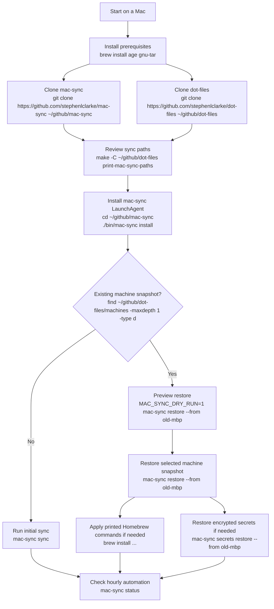
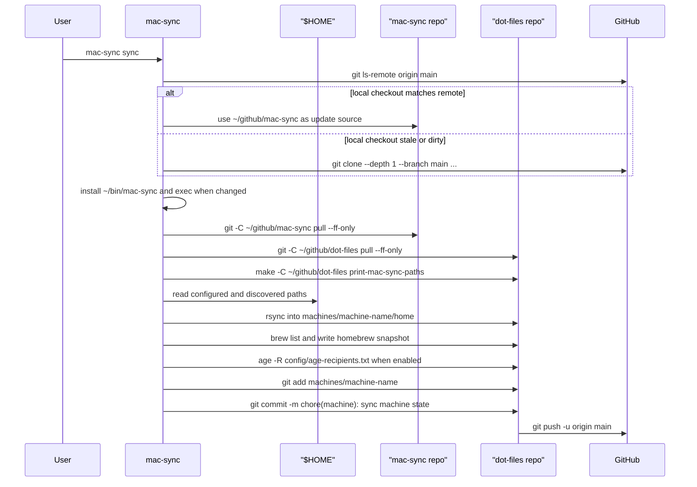
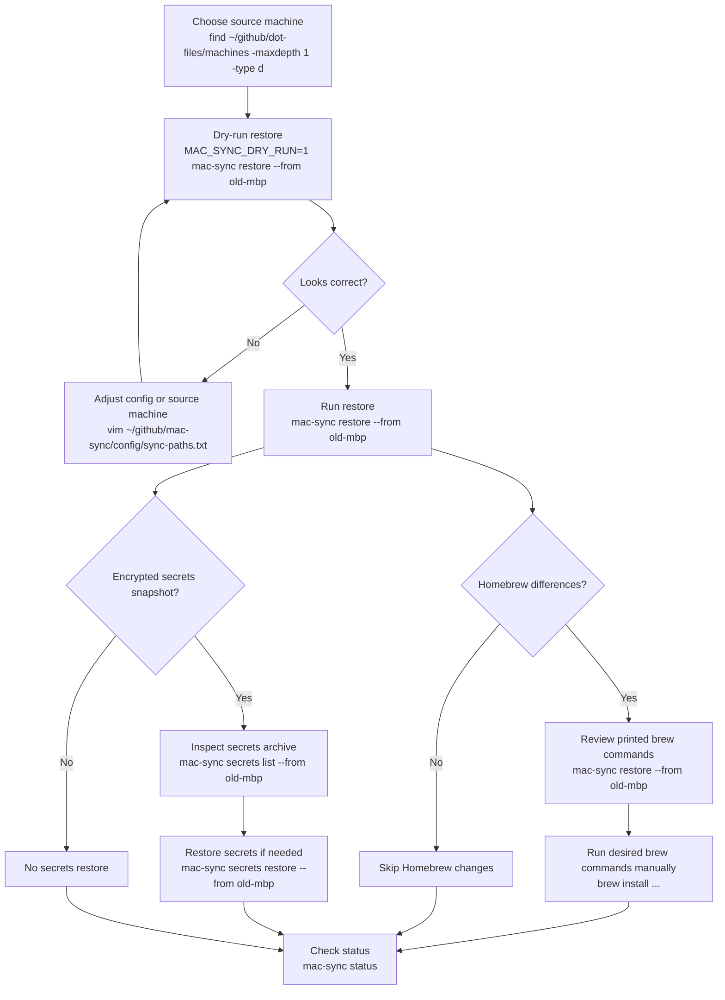
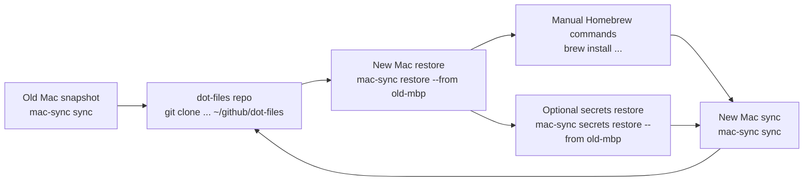

# mac-sync Workflow

This workflow describes how to download, configure, install, sync, and restore
`mac-sync` on a Mac.

`mac-sync` uses two repositories:

- `~/github/mac-sync`: command, configuration, tests, and documentation
- `~/github/dot-files`: per-machine snapshots under `machines/<machine-name>/`

## End-to-End Flow

<!-- markdownlint-disable MD013 -->



<!-- markdownlint-enable MD013 -->

## Download

Install Homebrew first if this Mac does not already have it. The encrypted
secrets workflow also needs `age` and GNU tar:

```sh
brew install age gnu-tar
```

Clone both repositories:

```sh
mkdir -p ~/github
git clone https://github.com/stephenlclarke/mac-sync ~/github/mac-sync
git clone https://github.com/stephenlclarke/dot-files ~/github/dot-files
```

Use a different location only when you also set the matching environment
variables:

```sh
MAC_SYNC_REPO=/path/to/mac-sync
MAC_SYNC_MACHINES_REPO=/path/to/dot-files
```

## Configure

Review the tracked configuration before the first sync. The preferred regular
path list comes from `~/github/dot-files`:

```sh
make -C ~/github/dot-files print-mac-sync-paths
```

`mac-sync` uses that Makefile target automatically when it exists. It falls back
to `~/github/mac-sync/config/sync-paths.txt` when the target is unavailable, or
when `MAC_SYNC_MANIFEST_SOURCE=config` is set.

- `config/sync-paths.txt`: fallback regular dotfiles and directories to copy
- `excludes.txt`: `rsync` exclude patterns used during dotfile sync
- `secret-paths.txt`: sensitive paths encrypted into the secrets archive
- `age-recipients.txt`: public `age` recipients trusted to decrypt secrets

The default machine name is derived from the macOS host name. Override it when
you want a stable or friendlier directory name:

```sh
MAC_SYNC_MACHINE=work-mbp ./bin/mac-sync install
```

The machine snapshot will be written under:

```text
~/github/dot-files/machines/<machine-name>/
```

## Install

Install from the `mac-sync` repo:

```sh
cd ~/github/mac-sync
./bin/mac-sync install
```

Install does this:

- copies the command to `~/bin/mac-sync`
- writes `~/Library/LaunchAgents/tools.xyzzy.mac-sync.plist`
- loads the LaunchAgent into the current GUI session
- schedules an hourly run at minute `0`

Change the hourly minute at install time:

```sh
MAC_SYNC_HOURLY_MINUTE=17 ./bin/mac-sync install
```

The LaunchAgent stores both repo paths in its environment, so the automated run
continues to use the same `mac-sync` and `dot-files` checkouts.

## Initial Sync

Run a manual sync once after installation:

```sh
mac-sync sync
```

During sync, `mac-sync`:

1. Checks the mac-sync GitHub remote directly for an installed command update.
2. Uses the local mac-sync checkout only if it matches that remote commit.
3. Clones the remote to a temporary directory when the local checkout is stale
   or dirty, then restarts with the updated installed command.
4. Pulls the local `mac-sync` repo when it is clean.
5. Pulls the `dot-files` repo when it is clean.
6. Copies configured paths from `$HOME` into the machine snapshot.
7. Discovers safe referenced dotfiles and persists dynamic paths.
8. Captures Homebrew taps, formulae, casks, and a generated `Brewfile`.
9. Updates an encrypted secrets snapshot when recipients and tools exist.
10. Commits and pushes `machines/<machine-name>` in the `dot-files` repo.

<!-- markdownlint-disable MD013 -->



<!-- markdownlint-enable MD013 -->

Check status after the first run:

```sh
mac-sync status
```

The status output shows the local repo, machines repo, next scheduled run, last
sync result, storage totals, warnings, errors, remote repo, and commit.

## Hourly Sync

After install, launchd runs:

```sh
~/bin/mac-sync run
```

`run` is the LaunchAgent alias for `sync`. Logs are written to:

```text
/tmp/mac-sync.out
/tmp/mac-sync.err
```

Local sync status is written outside git:

```text
~/Library/Application Support/mac-sync/status/<machine-name>.env
```

## Restore

Use restore when setting up a new Mac or copying a snapshot from another Mac.

Clone both repos first, then install the command:

```sh
mkdir -p ~/github
git clone https://github.com/stephenlclarke/mac-sync ~/github/mac-sync
git clone https://github.com/stephenlclarke/dot-files ~/github/dot-files
cd ~/github/mac-sync
./bin/mac-sync install
```

List available machine snapshots:

```sh
find ~/github/dot-files/machines -mindepth 1 -maxdepth 1 -type d -print
```

Preview a restore before writing files:

```sh
MAC_SYNC_DRY_RUN=1 mac-sync restore --from old-mbp
```

Restore the selected snapshot:

```sh
mac-sync restore --from old-mbp
```

Use `--force` only when the snapshot should win over newer local files:

```sh
mac-sync restore --from old-mbp --force
```

Restore copies regular dotfiles and prints Homebrew commands when the selected
machine snapshot differs from the current Mac. It does not run the Homebrew
commands for you.

<!-- markdownlint-disable MD013 -->



<!-- markdownlint-enable MD013 -->

## Encrypted Secrets

Initialize this Mac's Keychain-backed `age` identity:

```sh
mac-sync secrets init
```

That command stores the private identity in Apple Keychain and writes only the
public recipient to `config/age-recipients.txt` in the `mac-sync` repo.

Update the encrypted snapshot manually:

```sh
mac-sync secrets sync
```

Inspect a source machine's encrypted archive:

```sh
mac-sync secrets list --from old-mbp
```

Restore encrypted secrets:

```sh
mac-sync secrets restore --from old-mbp
```

Secrets restore refuses to overwrite existing local files unless `--force` is
used:

```sh
mac-sync secrets restore --from old-mbp --force
```

## Moving to Another Mac

For a replacement Mac, the usual order is:

1. Clone `mac-sync` and `dot-files`.
2. Install prerequisites.
3. Run `./bin/mac-sync install`.
4. Run `MAC_SYNC_DRY_RUN=1 mac-sync restore --from <old-machine>`.
5. Run `mac-sync restore --from <old-machine>`.
6. Run any printed Homebrew commands you actually want.
7. Run `mac-sync secrets init` to add this Mac as a trusted recipient.
8. Run `mac-sync secrets restore --from <old-machine>` if needed.
9. Run `mac-sync sync` to create this Mac's own snapshot.
10. Confirm with `mac-sync status`.

<!-- markdownlint-disable MD013 -->



<!-- markdownlint-enable MD013 -->

## Useful Commands

```sh
mac-sync help
mac-sync help restore
mac-sync help secrets
mac-sync list
mac-sync status
mac-sync sync
mac-sync restore --from <machine>
mac-sync secrets list --from <machine>
mac-sync secrets restore --from <machine>
mac-sync uninstall
```
