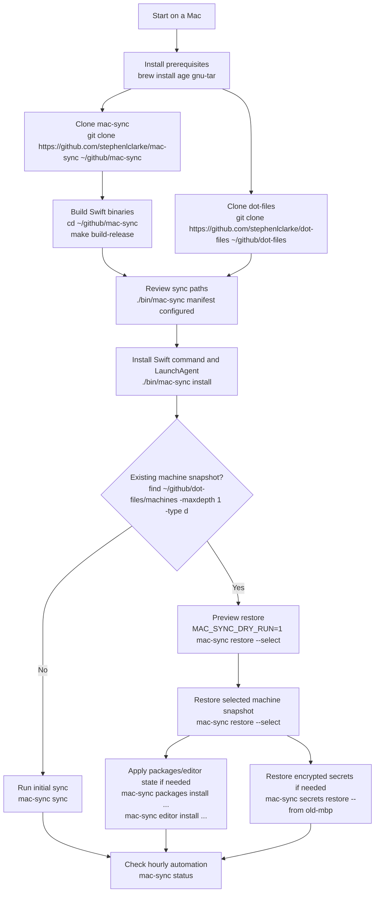
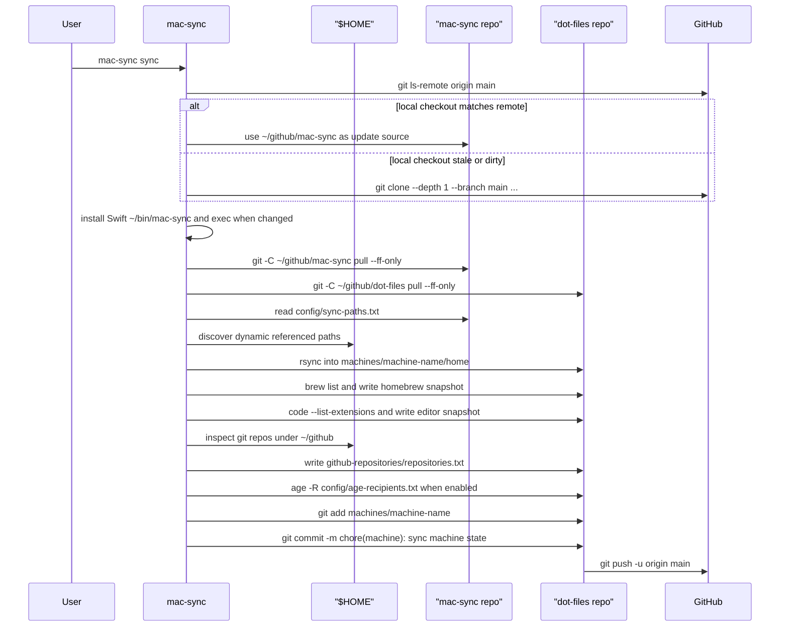
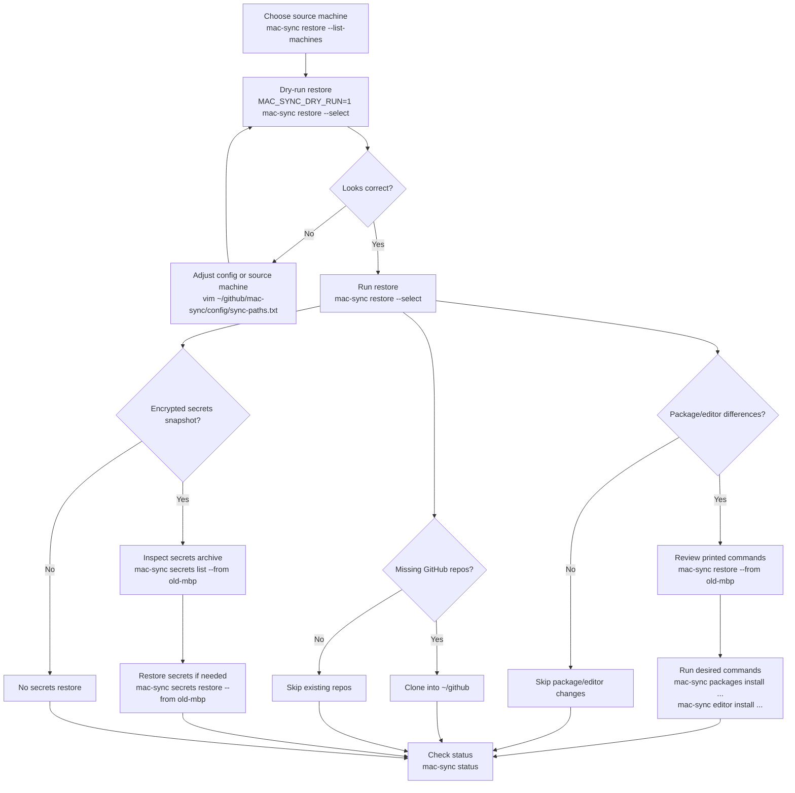
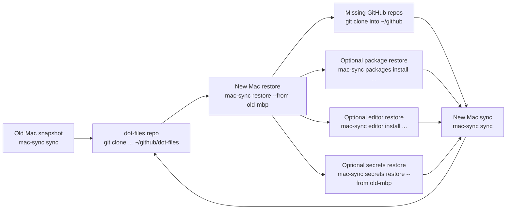

# mac-sync Workflow

This workflow describes how to download, configure, install, sync, restore, and
upgrade `mac-sync` on a Mac.

`mac-sync` is implemented as a SwiftPM package. The old Bash implementation has
been removed; `bin/mac-sync` and `bin/mac-spinner` are compatibility launchers
that run the built Swift executables or fall back to `swift run` during local
development.

`mac-sync` uses two repositories:

- `~/github/mac-sync`: command, backup/restore configuration, tests, and documentation
- `~/github/dot-files`: per-machine snapshots under `machines/<machine-name>/`
  including dotfiles, Homebrew state, VS Code extension state, encrypted secrets,
  and GitHub clone inventory

## End-to-End Flow

<!-- markdownlint-disable MD013 -->



<!-- markdownlint-enable MD013 -->

## Download

Install Homebrew first if this Mac does not already have it. The encrypted
secrets workflow also needs `age` and GNU tar:

```sh
brew install age gnu-tar
```

Install the released Swift binary with Homebrew when you want the managed
package:

```sh
brew tap stephenlclarke/tap
brew install mac-sync
```

For source installs, make sure the Swift toolchain is available:

```sh
swift --version
```

If `swift` is missing, install Xcode or the Xcode Command Line Tools before
continuing.

Clone both repositories for source installs and for snapshot storage:

```sh
mkdir -p ~/github
git clone https://github.com/stephenlclarke/mac-sync ~/github/mac-sync
git clone https://github.com/stephenlclarke/dot-files ~/github/dot-files
```

Use a different location only when you also set the matching environment
variables:

```sh
MAC_SYNC_REPO=/path/to/mac-sync
MAC_SYNC_MACHINES_REPO=/path/to/dot-files
```

## Configure

Review the tracked configuration before the first sync. The regular path list
lives in the `mac-sync` repo:

```sh
./bin/mac-sync manifest configured
```

- `config/sync-paths.txt`: regular dotfiles and directories to copy
- `config/excludes.txt`: `rsync` exclude patterns used during dotfile sync
- `config/secret-paths.txt`: sensitive paths encrypted into the secrets archive
- `config/age-recipients.txt`: public `age` recipients trusted to decrypt secrets

The default machine name is derived from the macOS host name. Override it when
you want a stable or friendlier directory name:

```sh
MAC_SYNC_MACHINE=work-mbp ./bin/mac-sync install
```

The machine snapshot will be written under:

```text
~/github/dot-files/machines/<machine-name>/
```

## Install

Build and install from the `mac-sync` repo:

```sh
cd ~/github/mac-sync
make build-release
./bin/mac-sync install
```

When Homebrew installed the binary, install the LaunchAgent from that binary:

```sh
mac-sync install
```

Install does this:

- copies the Swift command to `~/bin/mac-sync`
- copies the Swift spinner helper to `~/bin/mac-spinner`
- writes `~/Library/LaunchAgents/tools.xyzzy.mac-sync.plist`
- loads the LaunchAgent into the current GUI session
- schedules an hourly run at minute `0`

The installed files in `~/bin` should be Mach-O Swift executables. The old Bash
implementation is intentionally not kept as a fallback.

Change the hourly minute at install time:

```sh
MAC_SYNC_HOURLY_MINUTE=17 ./bin/mac-sync install
```

The LaunchAgent stores both repo paths in its environment, so the automated run
continues to use the same `mac-sync` and `dot-files` checkouts.

## Update From Bash to Swift

Use this section on Macs that already installed an older Bash-only `mac-sync`.
The goal is to stop the old LaunchAgent, build or install the Swift binary, and
overwrite `~/bin/mac-sync` and `~/bin/mac-spinner`.

Stop the current LaunchAgent if it is loaded:

```sh
launch_agent="$HOME/Library/LaunchAgents/tools.xyzzy.mac-sync.plist"
launchctl bootout "gui/$(id -u)" "$launch_agent" 2>/dev/null || true
```

Update the source checkout and build the Swift release binaries:

```sh
cd ~/github/mac-sync
git pull --ff-only
make build-release
```

Reinstall the command and LaunchAgent from the Swift build:

```sh
./bin/mac-sync install
```

If you prefer the Homebrew package instead of a source checkout:

```sh
brew tap stephenlclarke/tap
brew reinstall mac-sync
mac-sync install
```

Confirm that the installed commands are no longer Bash scripts:

```sh
file ~/bin/mac-sync ~/bin/mac-spinner
~/bin/mac-spinner --message upgraded --pending
~/bin/mac-sync status
```

`file` should report Mach-O executables. If it still reports shell scripts,
rerun the install command from a built Swift checkout or from the Homebrew
binary that should own this Mac.

Run a manual sync after upgrading:

```sh
~/bin/mac-sync sync
```

## Initial Sync

Run a manual sync once after installation:

```sh
mac-sync sync
```

During sync, `mac-sync`:

1. Checks the mac-sync GitHub remote directly for an installed command update.
2. Uses the local mac-sync checkout only if it matches that remote commit.
3. Clones the remote to a temporary directory when the local checkout is stale
   or dirty, then restarts with the updated installed command.
4. Pulls the local `mac-sync` repo when it is clean.
5. Pulls the `dot-files` snapshot repo when the current machine archive is
   clean, preserving unrelated local edits in that checkout.
6. Copies configured paths from `$HOME` into the machine snapshot.
7. Discovers safe referenced dotfiles and persists dynamic paths.
8. Captures Homebrew taps, formulae, casks, and a generated `Brewfile`.
9. Captures VS Code extensions when the `code` CLI is available.
10. Captures GitHub repos below `~/github` that have GitHub remotes.
11. Updates an encrypted secrets snapshot when recipients and tools exist.
12. Commits and pushes `machines/<machine-name>` in the `dot-files` repo.

<!-- markdownlint-disable MD013 -->



<!-- markdownlint-enable MD013 -->

Check status after the first run:

```sh
mac-sync status
```

The status output shows the `mac-sync` version SHA, local repo, machines repo,
next scheduled run, last sync result, storage totals, warnings, errors, remote
repo, and commit.

## Hourly Sync

After install, launchd runs:

```sh
~/bin/mac-sync run
```

`run` is the LaunchAgent alias for `sync`. Logs are written to:

```text
/tmp/mac-sync.out
/tmp/mac-sync.err
```

Local sync status is written outside git:

```text
~/Library/Application Support/mac-sync/status/<machine-name>.env
```

## Restore

Use restore when setting up a new Mac or copying a snapshot from another Mac.

Clone both repos first, then build and install the command:

```sh
mkdir -p ~/github
git clone https://github.com/stephenlclarke/mac-sync ~/github/mac-sync
git clone https://github.com/stephenlclarke/dot-files ~/github/dot-files
cd ~/github/mac-sync
make build-release
./bin/mac-sync install
```

List available machine snapshots:

```sh
mac-sync restore --list-machines
```

If this Mac's hostname has no matching snapshot, `mac-sync restore` offers the
available machines from the `dot-files` repo. If the hostname does match a
snapshot, `mac-sync restore` defaults to that snapshot; use `--select` to choose
another source interactively.

Preview a restore before writing files:

```sh
MAC_SYNC_DRY_RUN=1 mac-sync restore --select
```

Restore the selected snapshot:

```sh
mac-sync restore --select
```

Use `--force` only when the snapshot should win over newer local files:

```sh
mac-sync restore --from old-mbp --force
```

Restore copies regular dotfiles and prints Homebrew and VS Code commands when
the selected machine snapshot differs from the current Mac. It does not run
those package/editor commands for you. It also clones missing GitHub repos from
the selected machine's `github-repositories/repositories.txt` into `~/github`,
skipping targets that already exist.

<!-- markdownlint-disable MD013 -->



<!-- markdownlint-enable MD013 -->

## Encrypted Secrets

Initialize this Mac's Keychain-backed `age` identity:

```sh
mac-sync secrets init
```

That command stores the private identity in Apple Keychain and writes only the
public recipient to `config/age-recipients.txt` in the `mac-sync` repo.

Update the encrypted snapshot manually:

```sh
mac-sync secrets sync
```

Inspect a source machine's encrypted archive:

```sh
mac-sync secrets list --from old-mbp
```

Restore encrypted secrets:

```sh
mac-sync secrets restore --from old-mbp
```

Secrets restore refuses to overwrite existing local files unless `--force` is
used:

```sh
mac-sync secrets restore --from old-mbp --force
```

## Moving to Another Mac

For a replacement Mac, the usual order is:

1. Clone `mac-sync` and `dot-files`.
2. Install prerequisites.
3. Build or install the Swift binary, then run `./bin/mac-sync install`.
4. Run `mac-sync restore --list-machines` and pick the old Mac snapshot.
5. Run `MAC_SYNC_DRY_RUN=1 mac-sync restore --from <old-machine>`.
6. Run `mac-sync restore --from <old-machine>`.
7. Run `mac-sync packages install --from <old-machine>` if you want the old
   Homebrew state.
8. Run `mac-sync editor install --from <old-machine>` if you want the old VS
   Code extension state.
9. Run `mac-sync secrets init` to add this Mac as a trusted recipient.
10. Run `mac-sync secrets restore --from <old-machine>` if needed.
11. Re-run `mac-sync restore --from <old-machine>` if private repo cloning
    needed secrets that were restored in the previous step.
12. Run `mac-sync sync` to create this Mac's own snapshot.
13. Confirm with `mac-sync status`.

<!-- markdownlint-disable MD013 -->



<!-- markdownlint-enable MD013 -->

## Useful Commands

```sh
mac-sync help
mac-sync help restore
mac-sync help secrets
mac-sync list
mac-sync status
mac-sync sync
mac-sync restore --from <machine>
mac-sync packages diff --from <machine>
mac-sync packages install --from <machine>
mac-sync editor diff --from <machine>
mac-sync editor install --from <machine>
mac-sync manifest list
mac-sync secrets list --from <machine>
mac-sync secrets restore --from <machine>
mac-sync uninstall
```
