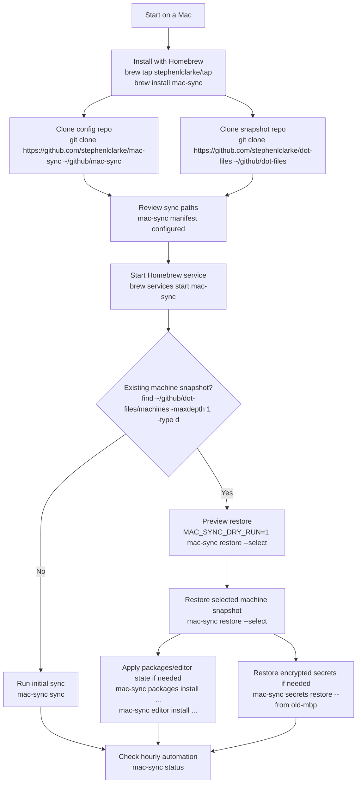
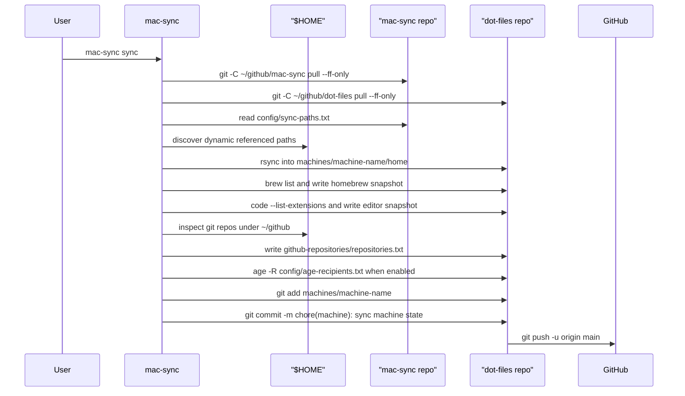
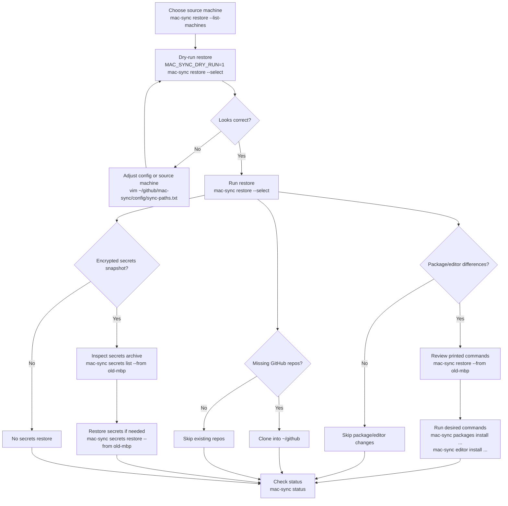
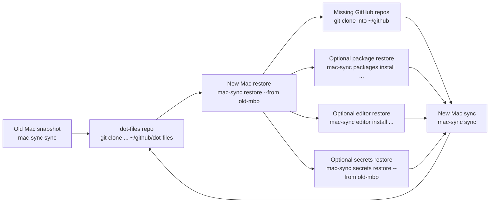

# mac-sync Workflow

This workflow describes how to download, configure, install, sync, restore, and update `mac-sync` on a Mac.

`mac-sync` is implemented as a SwiftPM package and installed as a Homebrew-managed binary. The CLI does not install or remove itself; Homebrew owns the installed executables and the launchd service.

`mac-sync` uses two repositories:

- `~/github/mac-sync`: command, backup/restore configuration, tests, and documentation
- `~/github/dot-files`: per-machine snapshots under `machines/<machine-name>/`
  including dotfiles, Homebrew state, VS Code extension state, encrypted secrets,
  and GitHub clone inventory

## End-to-End Flow

<!-- markdownlint-disable MD013 -->



<!-- markdownlint-enable MD013 -->

## Download

Install Homebrew first if this Mac does not already have it. Then install the
released Swift binary and runtime dependencies from Homebrew:

```sh
brew tap stephenlclarke/tap
brew install mac-sync
```

Clone both repositories for configuration and snapshot storage:

```sh
mkdir -p ~/github
git clone https://github.com/stephenlclarke/mac-sync ~/github/mac-sync
git clone https://github.com/stephenlclarke/dot-files ~/github/dot-files
```

Use a different location only when you also set the matching environment
variables:

```sh
MAC_SYNC_REPO=/path/to/mac-sync
MAC_SYNC_MACHINES_REPO=/path/to/dot-files
```

## Configure

Review the tracked configuration before the first sync. The regular path list
lives in the `mac-sync` repo:

```sh
mac-sync manifest configured
```

- `config/sync-paths.txt`: regular dotfiles and directories to copy
- `config/excludes.txt`: `rsync` exclude patterns used during dotfile sync
- `config/secret-paths.txt`: sensitive paths encrypted into the secrets archive
- `config/age-recipients.txt`: public `age` recipients trusted to decrypt secrets

The default machine name is derived from the macOS host name. Set
`MAC_SYNC_MACHINE` when running manual commands if you want a stable or
friendlier directory name:

```sh
MAC_SYNC_MACHINE=work-mbp mac-sync status
```

The machine snapshot will be written under:

```text
~/github/dot-files/machines/<machine-name>/
```

## Install

Homebrew owns installation and service management:

```sh
brew tap stephenlclarke/tap
brew install mac-sync
brew services start mac-sync
```

Use Homebrew for updates, restarts, and removal:

```sh
brew upgrade mac-sync
brew services restart mac-sync
brew services stop mac-sync
brew uninstall mac-sync
```

For local development only, build and run the Swift package directly from the checkout:

```sh
cd ~/github/mac-sync
make build-release
.build/release/mac-sync --help
```

## Initial Sync

Run a manual sync once after installation:

```sh
mac-sync sync
```

During sync, `mac-sync`:

1. Pulls the local `mac-sync` repo when it is clean.
2. Pulls the `dot-files` snapshot repo when the current machine archive is
   clean, preserving unrelated local edits in that checkout.
3. Copies configured paths from `$HOME` into the machine snapshot.
4. Discovers safe referenced dotfiles and persists dynamic paths.
5. Captures Homebrew taps, formulae, casks, and a generated `Brewfile`.
6. Captures VS Code extensions when the `code` CLI is available.
7. Captures GitHub repos below `~/github` that have GitHub remotes.
8. Updates an encrypted secrets snapshot when recipients and tools exist.
9. Commits and pushes `machines/<machine-name>` in the `dot-files` repo.

<!-- markdownlint-disable MD013 -->



<!-- markdownlint-enable MD013 -->

Check status after the first run:

```sh
mac-sync status
```

The status output shows the `mac-sync` version SHA, local repo, machines repo,
last sync result, storage totals, warnings, errors, remote repo, and commit.

## Hourly Sync

Homebrew services owns the launchd job:

```sh
brew services start mac-sync
brew services restart mac-sync
brew services stop mac-sync
brew services info mac-sync
```

The service runs `mac-sync run`, which is the automation entrypoint for `sync`.
Local sync status is written outside git:

```text
~/Library/Application Support/mac-sync/status/<machine-name>.env
```

## Restore

Use restore when setting up a new Mac or copying a snapshot from another Mac.

Install the Homebrew package and clone both repos first:

```sh
brew tap stephenlclarke/tap
brew install mac-sync
mkdir -p ~/github
git clone https://github.com/stephenlclarke/mac-sync ~/github/mac-sync
git clone https://github.com/stephenlclarke/dot-files ~/github/dot-files
```

List available machine snapshots:

```sh
mac-sync restore --list-machines
```

If this Mac's hostname has no matching snapshot, `mac-sync restore` offers the
available machines from the `dot-files` repo. If the hostname does match a
snapshot, `mac-sync restore` defaults to that snapshot; use `--select` to choose
another source interactively.

Preview a restore before writing files:

```sh
MAC_SYNC_DRY_RUN=1 mac-sync restore --select
```

Restore the selected snapshot:

```sh
mac-sync restore --select
```

Use `--force` only when the snapshot should win over newer local files:

```sh
mac-sync restore --from old-mbp --force
```

Restore copies regular dotfiles and prints Homebrew and VS Code commands when
the selected machine snapshot differs from the current Mac. It does not run
those package/editor commands for you. It also clones missing GitHub repos from
the selected machine's `github-repositories/repositories.txt` into `~/github`,
skipping targets that already exist.

<!-- markdownlint-disable MD013 -->



<!-- markdownlint-enable MD013 -->

## Encrypted Secrets

Initialize this Mac's Keychain-backed `age` identity:

```sh
mac-sync secrets init
```

That command stores the private identity in Apple Keychain and writes only the
public recipient to `config/age-recipients.txt` in the `mac-sync` repo.

Update the encrypted snapshot manually:

```sh
mac-sync secrets sync
```

Inspect a source machine's encrypted archive:

```sh
mac-sync secrets list --from old-mbp
```

Restore encrypted secrets:

```sh
mac-sync secrets restore --from old-mbp
```

Secrets restore refuses to overwrite existing local files unless `--force` is
used:

```sh
mac-sync secrets restore --from old-mbp --force
```

## Moving to Another Mac

For a replacement Mac, the usual order is:

1. Clone `mac-sync` and `dot-files`.
2. Install the Homebrew package.
3. Start or restart the Homebrew service when this Mac is ready for scheduled syncs.
4. Run `mac-sync restore --list-machines` and pick the old Mac snapshot.
5. Run `MAC_SYNC_DRY_RUN=1 mac-sync restore --from <old-machine>`.
6. Run `mac-sync restore --from <old-machine>`.
7. Run `mac-sync packages install --from <old-machine>` if you want the old
   Homebrew state.
8. Run `mac-sync editor install --from <old-machine>` if you want the old VS
   Code extension state.
9. Run `mac-sync secrets init` to add this Mac as a trusted recipient.
10. Run `mac-sync secrets restore --from <old-machine>` if needed.
11. Re-run `mac-sync restore --from <old-machine>` if private repo cloning
    needed secrets that were restored in the previous step.
12. Run `mac-sync sync` to create this Mac's own snapshot.
13. Confirm with `mac-sync status`.

<!-- markdownlint-disable MD013 -->



<!-- markdownlint-enable MD013 -->

## Useful Commands

```sh
mac-sync help
mac-sync help restore
mac-sync help secrets
mac-sync list
mac-sync status
mac-sync sync
mac-sync restore --from <machine>
mac-sync packages diff --from <machine>
mac-sync packages install --from <machine>
mac-sync editor diff --from <machine>
mac-sync editor install --from <machine>
mac-sync manifest list
mac-sync secrets list --from <machine>
mac-sync secrets restore --from <machine>
brew services restart mac-sync
brew upgrade mac-sync
```
